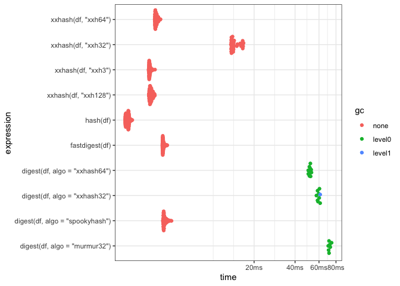

<!-- README.md is generated from README.Rmd. Please edit that file -->

# xxhashlite

<!-- badges: start -->


[](https://github.com/coolbutuseless/xxhashlite/actions/workflows/R-CMD-check.yaml)
<!-- badges: end -->

`xxhashlite` provides simple access to the *extremely* fast hashing
functions in [xxHash](https://cyan4973.github.io/xxHash/) for in-memory
hashing of R objects.

This new version of `xxhashlite` (v0.2.0) is a major update which now
offers fast hashing of *any* R object by internally leveraging R’s
serialization capabilities.

This package is a wrapper around [xxHash
v0.8.3](https://github.com/Cyan4973/xxHash).  
See `LICENSE-xxHash` for the copyright and licensing information for
that code. With this latest version of xxHash, the new (even faster)
hash functions, `xxh3_64bits` and `xxhash128`, are considered stable.

## Notes

- Only supports R versions \>= v3.5.0 as this is when the serialization
  infrastructure had a breaking change, and this package will not
  support the old version.

## What’s in the box

- `xxhash(robj, algo)` calculates the hash of any R object understood by
  `base::serialize()`.
- `xxhash_raw(vec, algo)` calculates the hash of a raw vector or string.
  This function is appropriate when comparing hashes of non-R objects.
- `xxhash_file(file, algo)` calculates the hash of a file

## Installation

You can install from
[GitHub](https://github.com/coolbutuseless/xxhashlite) with:

``` r
# install.package('remotes')
remotes::install_github('coolbutuseless/xxhashlite)
```

## Why use a hash?

A hash is a way of succinctly summarising the contents of an object in a
compact format.

If there are changes to the object (no matter how small) then the hash
should change as well.

``` r
library(xxhashlite)
xxhash(mtcars)
#> [1] "d0487363db4e6cc64fdb740cb6617fc0"

# Small changes results in a different hash
mtcars$cyl[1] <- 0
xxhash(mtcars)
#> [1] "e999db3ed8f21dc2cd52b97a08f0c9f5"
```

## Timing for hashing arbitrary R objects

`xxhashlite` uses the [xxHash](https://github.com/Cyan4973/xxHash)
family of hash functions to provide very fast hashing of R objects.

For the test case shown below, `xxhashlite` is faster at calculating a
hash than all other methods I could find, with a maximum hashing speed
in this specific case of 20 GB/s.

Note: actual hashing speed will still depend on R’s serialization
functions e.g. small complex data.frames might have a lot of
serialization overhead compared to long numeric vectors.

<details>
<summary>
Click to show/hide the benchmarking code
</summary>

``` r
library(xxhashlite)
library(digest)
library(fastdigest)
library(rlang)
#> 
#> Attaching package: 'rlang'
#> The following object is masked from 'package:pryr':
#> 
#>     bytes

#~~~~~~~~~~~~~~~~~~~~~~~~~~~~~~~~~~~~~~~~~~~~~~~~~~~~~~~~~~~~~~~~~~~~~~~~~~~~~
# Simple data.frame
#~~~~~~~~~~~~~~~~~~~~~~~~~~~~~~~~~~~~~~~~~~~~~~~~~~~~~~~~~~~~~~~~~~~~~~~~~~~~~
N   <- 5e6
df  <- data.frame(
  x = runif(N),
  y = sample(N)
)

size <- pryr::object_size(df)
size
#> 60.00 MB


res <- bench::mark(
  # {xxhashlite}
  hash(df),
  
  xxhash(df, 'xxh32'),
  xxhash(df, 'xxh64'),
  xxhash(df, 'xxh128'),
  xxhash(df, 'xxh3'),
  
  # {digest}
  digest(df, algo = 'xxhash32'),
  digest(df, algo = 'xxhash64'),
  digest(df, algo = 'murmur32'),
  digest(df, algo = 'spookyhash'),
  
  # {fastdigest}
  fastdigest(df),
  
  check = FALSE
)
#> Warning: Some expressions had a GC in every iteration; so filtering is
#> disabled.
```

</details>

| package     | expression                      |  median | itr/sec |    MB/s |
|:------------|:--------------------------------|--------:|--------:|--------:|
| rlang::hash | hash(df)                        |  2.36ms |     426 | 24214.7 |
| xxhashlite  | xxhash(df, “xxh32”)             | 14.09ms |      69 |  4061.5 |
| xxhashlite  | xxhash(df, “xxh64”)             |   3.8ms |     262 | 15070.6 |
| xxhashlite  | xxhash(df, “xxh128”)            |  3.48ms |     286 | 16453.1 |
| xxhashlite  | xxhash(df, “xxh3”)              |   3.4ms |     293 | 16817.4 |
| digest      | digest(df, algo = “xxhash32”)   | 59.76ms |      17 |   957.5 |
| digest      | digest(df, algo = “xxhash64”)   | 51.58ms |      19 |  1109.4 |
| digest      | digest(df, algo = “murmur32”)   | 71.14ms |      14 |   804.3 |
| digest      | digest(df, algo = “spookyhash”) |  4.36ms |     226 | 13114.2 |
| fastdigest  | fastdigest(df)                  |  4.28ms |     232 | 13365.5 |

Hashing a simple data.frame



## Related Software

- The original [xxHash](https://cyan4973.github.io/xxHash/) software.
- The [`digest`](https://cran.r-project.org/package=digest) package is a
  much more comprehensive approach to hashing from within R - multiple
  hashing functions and much more configurability
- The [`hashFunction`](https://cran.r-project.org/package=hashFunction)
  package offers some hasing functions that work directly on character
  or integer values.
- The [`fastdigest`](https://cran.r-project.org/package=fastdigest)
  offers the fast non-cryptographic ‘SpookyHash’ and will hash anything
  that serialize knows about.

## Acknowledgements

- Yann Collett for releasing, maintaining and advancing
  [xxHash](https://cyan4973.github.io/xxHash/)
- R Core for developing and maintaining such a great language.
- CRAN maintainers, for patiently shepherding packages onto CRAN and
  maintaining the repository
